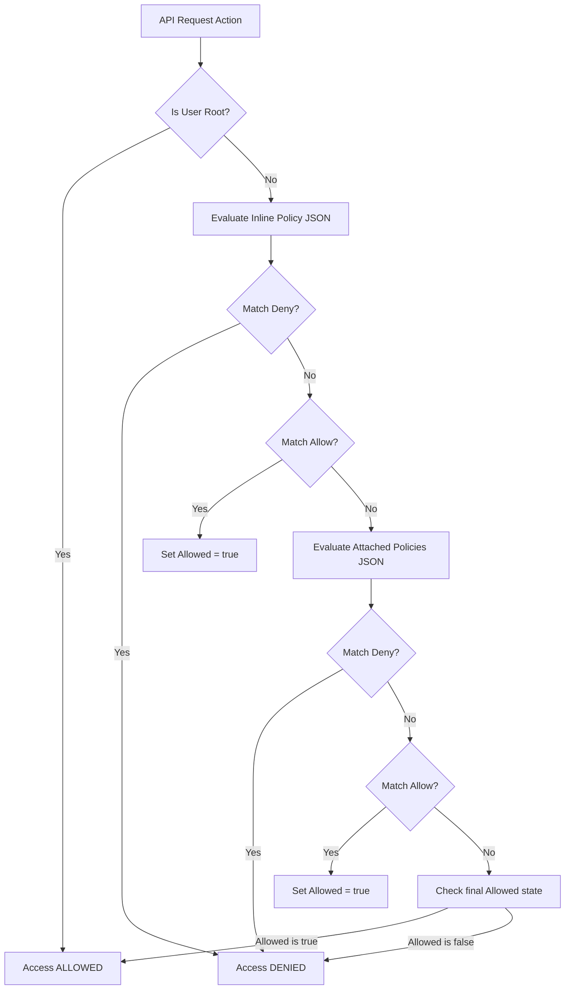

# 📖 MiniCloud: Architectural Feature Directory & Deep Dive

This document details the inner workings, system design, object-oriented (OOP) design patterns, database schemas, and workflow execution steps for every simulated AWS service inside MiniCloud.

---

## 1. 🔐 Identity & Access Management (IAM)

### Architecture & Design Patterns
*   **RBAC & ABAC Hybrid**: Supports both Role-Based Access Control (`UserRole` mapping to `ADMIN`/`USER`) and Attribute-Based Access Control (using JSON Policies evaluating context attributes).
*   **Composite Pattern**: Policies contain a hierarchy of statements, each specifying arrays of actions, resources, and conditions.
*   **Singleton/Component Evaluator**: [PolicyEvaluator.java](file:///c:/Users/HP/OneDrive/Desktop/MINI-AWS/Mini-AWS/minicloud-api/src/main/java/com/minicloud/api/iam/PolicyEvaluator.java) is a stateless Spring `@Component` that processes authorization evaluations.

### Workflow & Logic Flow
When an API request hits a controller protected by permission checks (e.g., launching an EC2 instance), the following authorization routine is executed:



### Context variables and Conditions
*   **Variable Substitution**: Before parsing the JSON document, the parser substitutes runtime context variables:
    *   `${aws:username}` maps to the active user's username.
    *   `${aws:PrincipalAccount}` maps to the user's 12-digit AWS account ID.
*   **Condition Evaluators**: Condition matching supports array verification:
    *   `StringEquals`: Case-sensitive string comparison.
    *   `StringLike`: Case-insensitive wildcard pattern matching (e.g. `s3:Get*`).
    *   `IpAddress`: Prefix matching for CIDRs (e.g., source IP matches `192.168.1.0/24`).

---

## 2. 💻 Elastic Compute Cloud (EC2)

### Architecture & Design Patterns
*   **Observer/Manager Pattern**: [ProcessManager.java](file:///c:/Users/HP/OneDrive/Desktop/MINI-AWS/Mini-AWS/minicloud-api/src/main/java/com/minicloud/api/compute/ProcessManager.java) manages and tracks subprocesses mapped in a thread-safe `ConcurrentHashMap`.
*   **Strategy Pattern**: Commands are processed by either the Docker container execution sandbox or the native host execution fallback based on startup diagnostic checks.

### execution flow:
```
  [User Action: Launch EC2]
              │
              ▼
    [CommandSanitizer]  ──────► (Blocks injection: ;, &&, ||, backticks, $())
              │
              ▼
  [ProcessManager checks Docker]
        /           \
    (Active)     (Inactive)
      /               \
     ▼                 ▼
[Docker Sandbox]   [Native OS Subprocess]
- Spawn alpine      - Windows: cmd.exe /c
- Isolation         - Linux: bash -c
     │                 │
     └────────┬────────┘
              │
              ▼
  [Process ID mapped to DB]
```

### Networking Advisor
EC2 instances are assigned static private IPs (typically `172.31.x.x` ranges mapping to standard AWS subnets) and public elastic IPs using a pseudo-random networking allocation strategy inside `NetworkingAdvisor`.

---

## 3. 🪣 Simple Storage Service (S3)

### Storage & Serialization Design
*   **Hybrid Persistence**:
    - **Database (`storage_objects`)**: Stores binary references, checksums (MD5 ETag), content lengths, content types, and bucket ownership relationships.
    - **Local Disk System**: Serializes the raw binary stream directly under `./minicloud-data/storage/<bucket-name>/<object-key>`.
*   **S3 Static Website Hosting**:
    - A bucket can be toggled into website mode.
    - Requests routed to `/site/<bucket-name>/<path>` are caught by `WebsiteController`.
    - It reads the requested asset from local disk storage. If not found, it falls back to the bucket's configured `IndexDocument` (e.g., `index.html`) or serves the custom `ErrorDocument` (e.g., `error.html`) with a `404` status code.

---

## 4. ⚡ AWS Lambda

### Under the Hood
*   **Mounting Logic**: Code execution mimics real AWS Lambda container mount patterns:
    1. Downloads/resolves the function artifact from its configured S3 bucket.
    2. Extracts/caches it in `./minicloud-data/lambda-tmp/<functionId>/`.
    3. Mounts the folder to `/var/task` inside a corresponding runtime container:
        - **Python**: `python:3.9-slim` running `python /var/task/<filename>`
        - **Node.js**: `node:18-alpine` running `node /var/task/<filename>`
        - **Java**: `openjdk:17-slim` running `java -cp /var/task/<filename> <handler>`
        - **Go**: `golang:1.19-alpine` running `go run /var/task/<filename>`
    4. Pipes input parameters directly into the container's stdin.
    5. Captures the container's stdout/stderr streams.
*   **CloudWatch Logs Ingestion**: Ingests stdout/stderr output lines directly into CloudWatch Log Streams under the log group `/aws/lambda/<function-name>`.

---

## 5. 🌐 Virtual Private Cloud (VPC) & Networking

### Stateless NACLs vs. Stateful Security Groups

MiniCloud implements two distinct virtual firewall layers acting at different scopes:

| Attribute | Security Groups (Stateful) | Network ACLs (NACLs) (Stateless) |
|---|---|---|
| **Acting Boundary** | Instance Level (EC2) | Subnet Boundary Level |
| **State Nature** | Stateful (return traffic is automatically allowed) | Stateless (return traffic must be explicitly allowed) |
| **Rule Application** | Evaluates all rules; allows traffic if any rule matches. Defaults to deny. | Evaluates rules sequentially from lowest to highest rule number. First match wins. |
| **MiniCloud Class** | `NetworkingAdvisor` | `NetworkAclService` |

### NACL Evaluation Workflow
When traffic is routed by the reverse proxy (`ProxyService`), the request is checked before forwarding:

```
[Incoming Request] ──► [Evaluate Subnet NACL] ──► [Evaluate Instance Security Group] ──► [Forward to Port]
                             │                                 │
                         (Blocked)                         (Blocked)
                             │                                 │
                             ▼                                 ▼
                     [403 Forbidden]                   [403 Forbidden]
```

---

## 6. 📊 CloudWatch (Metrics & Logs) & CloudTrail (Auditing)

### Operating System Metrics (OSHI)
`MetricsService` utilizes native JVM bindings through the **OSHI (Operating System and Hardware Information)** library:
- **CPU Utilization**: Samples system CPU load averages.
- **RAM footprint**: Captures JVM and physical memory totals/availables.
- **Disk IO**: Tracks space usage inside the storage volume.
- These metrics are polled every 5 seconds and broadcasted to the desktop UI via WebSocket STOMP handlers.

### Immutable Audit Logs (CloudTrail)
The `AuditService` records system-wide transactions:
- Every action (e.g. `RunInstances`, `CreateBucket`, `PutObject`, `InvokeLambda`) writes a log entry.
- Contains: `username`, `service`, `action`, `resource`, `status` (success/failure details), and `timestamp`.
- Errors/Authorization failures are logged with an `Access Denied` flag.

---

## 7. 💸 Billing & Auto-Scaling

### Billing Cost Accumulation
`BillingService` monitors active resources using a background scheduler:
*   Running EC2 instances: Accumulated at `$0.0116` per minute (simulating `t2.micro` rates).
*   Managed RDS instances: Accumulated at `$0.0350` per minute.
*   S3 storage storage footprint: Calculated per GB-month.
*   Invoices are generated monthly containing detailed cost listings, itemized usage, and total calculations.

### Auto-Scaling Replica Manager
*   Tracks registered Auto Scaling Groups (ASGs).
*   Whenever a CloudWatch Alarm goes into `ALARM` state (e.g., CPU metric > 80% for 2 evaluation periods), it calls the Auto-Scaling controller.
*   The controller invokes `ComputeService` to launch clone EC2 instances using the configured launch template, adding them to the routing group.
*   Conversely, when the scale-down alarm is triggered (e.g. CPU < 20%), it terminates instances to scale down.
